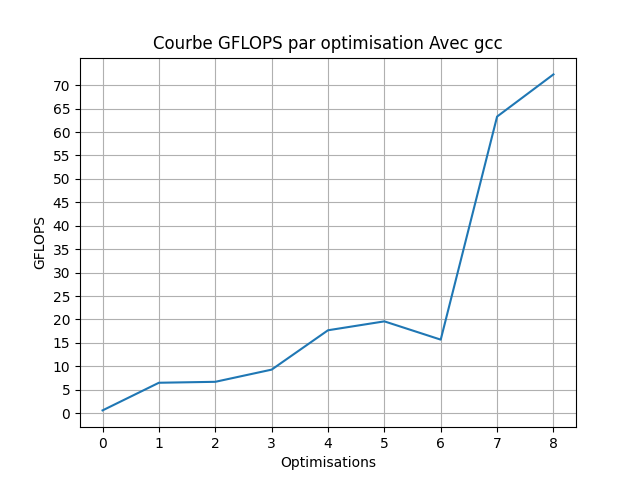
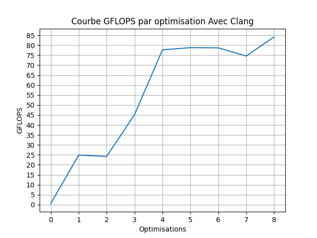
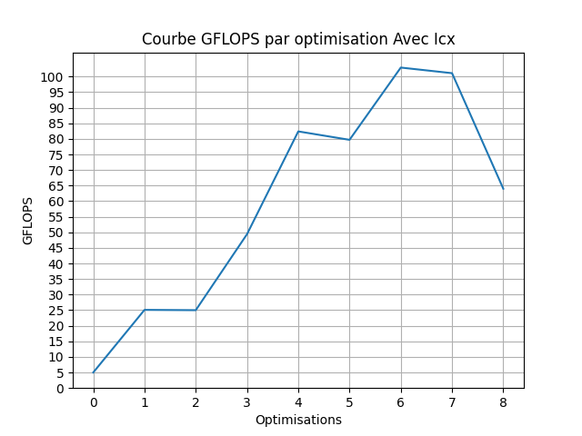

# N-body 3D — Optimization Study

A step-by-step performance optimization of a 3D **N-body** gravitational
simulation in C, taking the naive `O(N²)` direct-sum solver from a scalar
baseline to a hand-vectorized, multi-threaded implementation — and measuring
the gain at every step across **three compilers** (GCC, Clang, Intel `icx`).


---

## The problem

Each of `N` bodies attracts every other body through Newtonian gravity. Computing
the force on every body requires evaluating all pairwise interactions, giving a
cost of `O(N²)` per time step. The simulation advances velocities and positions
over a fixed number of steps; throughput is reported in **GFLOP/s** (with the
first few iterations discarded as warm-up).

This project does **not** change the algorithm (no Barnes-Hut / FMM) — it keeps
the exact same `O(N²)` math and focuses entirely on **how efficiently that math
is executed on the hardware**.

## The optimization journey

Each step builds on the previous one. The source files are numbered so the
progression is readable at a glance.

| Step | File | Technique | Idea |
|-----:|------|-----------|------|
| 00 | `src/00_baseline.c` | **Baseline (AoS)** | Reference `O(N²)` solver, Array-of-Structures layout, `pow()` in the hot loop. |
| 01 | `src/01_soa_aligned.c` | **SoA + alignment** | Structure-of-Arrays with each array aligned to a 64-byte cache line for contiguous, vectorizable access. |
| 02 | `src/02_restrict.c` | **`restrict`** | Tell the compiler the arrays never alias, unlocking more aggressive scheduling and vectorization. |
| 03 | `src/03_without_pow.c` | **Remove `pow()`** | Replace `pow(d², 3/2)` with one `sqrt` and two multiplications. |
| 04 | `src/04_parallel.c` | **OpenMP threads + SIMD** | `#pragma omp parallel for` over bodies, `#pragma omp simd reduction` over the inner loop. |
| 05 | `src/04_parallel.c` | **Aggressive flags** | Same source as step 04, compiled with `-O3 -ffast-math -funroll-loops` (Intel: `-fast`). |
| 06 | `src/06_unrolling.c` | **Manual unrolling ×4** | Unroll the inner loop by 4 to expose more independent work. |
| 07 | `src/07_cache_blocking.c` | **Cache blocking** | Tile the outer loop to improve cache reuse. ⚠️ see [Known issues](docs/known-issues.md). |
| 08 | `src/08_intrinsics.c` | **AVX/FMA intrinsics** | Hand-vectorize with `__m256` / `_mm256_fmadd_ps`, 8 bodies per register. ⚠️ see [Known issues](docs/known-issues.md). |

> **Note on correctness.** Steps 00–06 compute the correct result. Steps 07 and
> 08 contain known bugs and are kept exactly as benchmarked; they are documented
> openly in [`docs/known-issues.md`](docs/known-issues.md).

## Build

A single parameterized `Makefile` builds every step for any of the three
compilers. Binaries land in `bin/` suffixed with the compiler name
(e.g. `bin/04_parallel_gcc`).

```bash
make                 # build every step with gcc (default)
make CC=clang        # ... with clang
make CC=icx          # ... with the Intel compiler
make 08_intrinsics   # build a single step
make clean
```

**Requirements:** a C compiler with OpenMP support and a CPU with AVX/FMA
(needed for step 08). `-march=native` / `-xHost` targets the build machine.

## Run

```bash
# direct
OMP_NUM_THREADS=8 ./bin/04_parallel_gcc 16384

# or via the Makefile helper
make run STEP=04_parallel N=16384 THREADS=8 CC=gcc
```

The argument is the number of bodies `N` (default `16384`). Sample output:

```
Total memory size: 393216 B, 384 KiB, 0 MiB

 Step    Time, s  Interact/s  GFLOP/s
    0  1.030e-02  4.069e+08      9.4
    ...
-----------------------------------------------------
Average performance:         9.3 +- 0.0 GFLOP/s
-----------------------------------------------------
```

## Reproduce the benchmarks

```bash
./scripts/run_benchmarks.sh gcc   16384 8
./scripts/run_benchmarks.sh clang 16384 8
./scripts/run_benchmarks.sh icx   16384 8
```

Each run builds every step and writes `benchmarks/results_<compiler>.csv`
(`step,gflops`).

## Results

Gain curves across the optimization steps, per compiler:

| GCC | Clang | Intel icx |
|-----|-------|-----------|
|  |  |  |

Summary (fill in with your measured averages at `N = 16384`):

| Step | GCC (GFLOP/s) | Clang | icx |
|------|---------------|-------|-----|
| 00 baseline           | _( )_ | _( )_ | _( )_ |
| 01 soa + aligned      | _( )_ | _( )_ | _( )_ |
| 02 restrict           | _( )_ | _( )_ | _( )_ |
| 03 without pow        | _( )_ | _( )_ | _( )_ |
| 04 parallel           | _( )_ | _( )_ | _( )_ |
| 05 aggressive flags   | _( )_ | _( )_ | _( )_ |
| 06 unrolling          | _( )_ | _( )_ | _( )_ |
| 07 cache blocking     | _( )_ | _( )_ | _( )_ |
| 08 intrinsics         | _( )_ | _( )_ | _( )_ |

See [`docs/hardware.md`](docs/hardware.md) for the test environment.

## Project structure

```
nbody3d-optimization/
├── README.md
├── LICENSE
├── Makefile                  # unified, parameterized by compiler
├── src/                      # one file per optimization step (00 → 08)
├── benchmarks/               # gain curves + CSV results
├── docs/
│   ├── hardware.md           # test environment
│   ├── known-issues.md       # honest notes on steps 07–08
│   └── images/               # lscpu / lstopo screenshots
├── scripts/
│   └── run_benchmarks.sh
└── bin/                      # build output (git-ignored)
```

## License

Released under the [MIT License](LICENSE).
