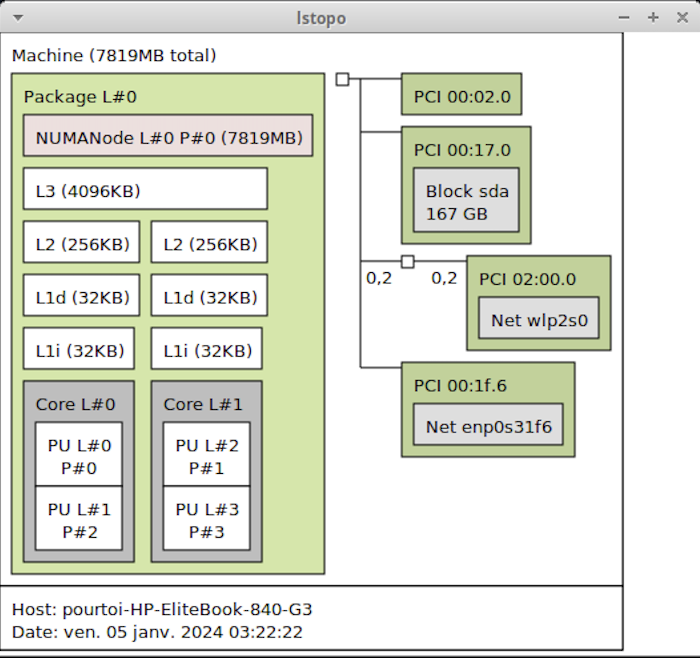
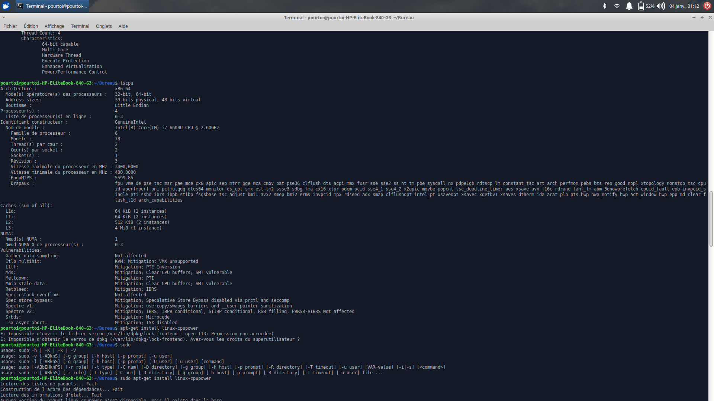

# Test environment

All benchmarks were collected on a single machine. Replace the placeholders
below with the values from the hardware files you captured (`cpu.info`,
`L1.info`, `L2.info`, `L3.info`, `lscpu`, `lstopo`).

## CPU

| Property            | Value                          |
|---------------------|--------------------------------|
| Model               | _(from `lscpu` / `cpu.info`)_  |
| Microarchitecture   | _(e.g. Skylake, Zen 3)_        |
| Physical cores      | _( )_                          |
| Threads             | _( )_                          |
| Base / boost clock  | _( )_                          |
| SIMD width          | _(AVX2 / AVX-512)_             |

## Cache hierarchy

| Level | Size            | Notes                 |
|-------|-----------------|-----------------------|
| L1d   | _(from L1.info)_ | per core             |
| L2    | _(from L2.info)_ |                      |
| L3    | _(from L3.info)_ | shared               |

## Toolchain

| Compiler | Version |
|----------|---------|
| gcc      | _( )_   |
| clang    | _( )_   |
| icx      | _( )_   |

## Topology

Add your `lstopo` / `lscpu` screenshots to `docs/images/` and reference them:

```


```
